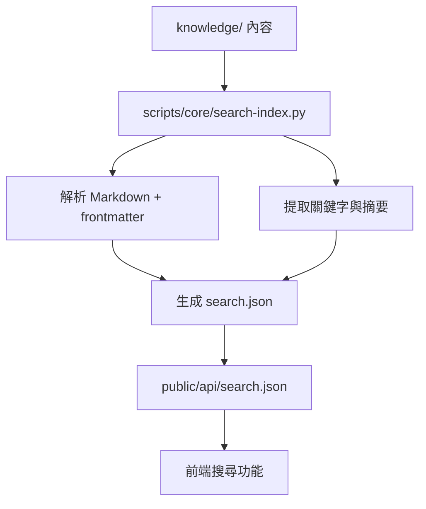
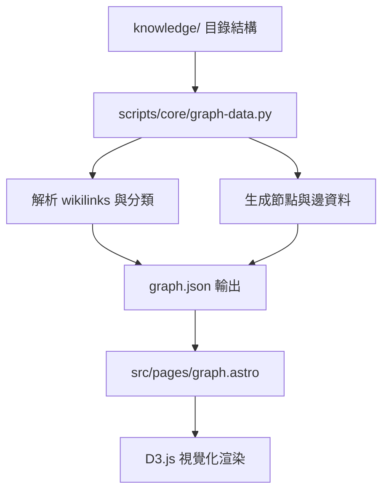

# ARCHITECTURE.md - 嘉義國本學堂完整系統架構

## 1. 專案基本資訊

- **專案名稱**：嘉義國本學堂
- **Repo 名稱**：`agrischlchiayi`
- **GitHub Repo**：https://github.com/ahnchen1983/agrischlchiayi
- **更新日期**：2026-04-18
- **負責人**：ahnchen

## 2. 專案願景

將嘉義縣政府農業處「國本學堂」與延伸在地農業資料，整理為一個：

- **公開可讀**：任何人都能直接瀏覽學習
- **開源可編修**：以 Markdown 為主體，方便協作與版本管理
- **可持續成長**：隨著課程、案例、交流持續擴充

核心願景是讓新農、返鄉青年、學生與農場經營者，有一個結構清楚、可搜尋、可視覺化探索的農業知識入口。

## 3. 核心功能設定

### 已實作功能

- 首頁與主題導覽
- `13` 大農業主類別頁
- 文章頁面與 frontmatter schema
- `graph` 知識圖譜頁面
- 搜尋索引與 `public/api` JSON 輸出
- `RSS / feed.xml`
- GitHub Pages 靜態部署

### 持續演進項目

- 內容量擴充與來源補強
- `Taiwan.md` fork 遺留頁面與品牌文字清理
- 多語系與農業專屬 SEO 微調
- 更多學習路徑與主題索引
- 農民耕作資料整合

## 4. 系統架構

### 4.1 Content Architecture

```text
knowledge/                  -> 內容真相來源（SSOT）
   │
   └─ scripts/core/sync.sh  -> 同步 / 清理 / frontmatter 修復
         │
         ▼
src/content/zh-TW/          -> Astro 內容投影層
         │
         ▼
src/pages + src/templates   -> 頁面渲染
         │
         ▼
GitHub Pages                -> 靜態網站輸出
```

### 4.2 技術選型

- **框架**：Astro 6
- **視覺化**：D3.js
- **內容格式**：Markdown + YAML frontmatter
- **建置腳本**：Node.js / bash / Python 輔助腳本
- **部署**：GitHub Pages

### 4.3 Base URL / Routing 規範

目前部署在 GitHub Pages 子路徑：

```js
base: '/agrischlchiayi';
```

因此：

- `.astro` 檔案的內部連結應優先使用 `import.meta.env.BASE_URL`
- inline script 應透過 `window.__BASE__` 或注入變數取得 base
- 不建議直接寫死 `href="/..."` 或 `src="/..."`

## 5. 詳細資料流圖

### 5.1 內容處理流程

```mermaid
graph TD
    A[knowledge/*.md] --> B[scripts/core/sync.sh]
    B --> C[frontmatter 驗證與修復]
    B --> D[內容清理與格式化]
    C --> E[src/content/zh-TW/ 投影]
    D --> E
    E --> F[Astro Content Collections]
    F --> G[src/pages/[category]/[slug].astro]
    F --> H[src/pages/[category]/index.astro]
    G --> I[靜態 HTML 生成]
    H --> I
    I --> J[public/ 輸出]
```

### 5.2 搜尋索引生成流程



### 5.3 圖譜生成流程



## 6. 各 Component / Template 職責與 API

### 6.1 主要 Templates

| Template | 位置 | 職責 | API / Props |
|----------|------|------|------------|
| `ArticleLayout` | `src/layouts/ArticleLayout.astro` | 文章頁面佈局，包含導覽、內容、相關文章 | `title`, `description`, `content`, `related` |
| `CategoryLayout` | `src/layouts/CategoryLayout.astro` | 分類頁面佈局，展示文章列表 | `category`, `articles[]`, `description` |
| `BaseLayout` | `src/layouts/BaseLayout.astro` | 基礎佈局，包含 header, footer, SEO | `title`, `description`, `ogImage` |

### 6.2 核心 Components

| Component | 位置 | 職責 | API / Props |
|-----------|------|------|------------|
| `Graph` | `src/components/Graph.tsx` | D3.js 知識圖譜渲染 | `data: GraphData`, `width`, `height` |
| `Search` | `src/components/Search.tsx` | 搜尋功能組件 | `index: SearchIndex`, `onResult` |
| `ArticleCard` | `src/components/ArticleCard.astro` | 文章卡片展示 | `title`, `excerpt`, `slug`, `category` |
| `CategoryNav` | `src/components/CategoryNav.astro` | 分類導覽 | `categories[]`, `currentCategory` |
| `Header` | `src/components/Header.astro` | 網站標頭 | `baseUrl`, `navItems[]` |
| `Footer` | `src/components/Footer.astro` | 網站頁尾 | `links[]` |

### 6.3 Page Components

| Page | 職責 | 資料來源 |
|------|------|----------|
| `index.astro` | 首頁，展示精選內容與分類入口 | `src/content/zh-TW/_Home.md` |
| `[category]/index.astro` | 分類首頁，列表該分類所有文章 | Content Collections API |
| `[category]/[slug].astro` | 文章頁面，渲染單篇文章 | Content Collections API |
| `graph.astro` | 圖譜頁面，知識網路視覺化 | `public/api/graph.json` |
| `about.astro` | 關於頁面，專案介紹 | 靜態內容 |
| `contribute.astro` | 貢獻指南 | 靜態內容 + `CONTRIBUTING.md` |

## 7. 建置流程詳解

### 7.1 Prebuild 階段

```bash
# scripts/core/prebuild.sh
1. 驗證 knowledge/ 目錄結構
2. 檢查 frontmatter schema 完整性
3. 清理無效的 wikilinks
4. 生成分類索引
```

### 7.2 Build 階段 (Astro)

```bash
npm run build
1. Astro 編譯 .astro 檔案
2. 處理 Content Collections
3. 生成靜態 HTML
4. 優化資源 (CSS, JS, 圖片)
5. 輸出到 dist/
```

### 7.3 Postbuild 階段

```bash
# scripts/core/postbuild.sh
1. 複製 dist/ 到 public/
2. 生成搜尋索引 (search.json)
3. 生成圖譜資料 (graph.json)
4. 更新 RSS feed
5. 驗證內部連結完整性
```

### 7.4 完整建置指令

```bash
# 開發建置
npm run dev

# 生產建置
npm run build

# 完整流程 (含前後處理)
./scripts/core/full-build.sh
```

## 8. 部署流程與 CI/CD

### 8.1 GitHub Pages 部署

```yaml
# .github/workflows/deploy.yml
name: Deploy to GitHub Pages
on:
  push:
    branches: [ main ]
jobs:
  build-and-deploy:
    runs-on: ubuntu-latest
    steps:
    - uses: actions/checkout@v3
    - uses: actions/setup-node@v3
      with:
        node-version: '18'
    - run: npm ci
    - run: npm run build
    - uses: peaceiris/actions-gh-pages@v3
      with:
        github_token: ${{ secrets.GITHUB_TOKEN }}
        publish_dir: ./dist
        cname: agrischlchiayi.github.io
```

### 8.2 部署檢查清單

- [ ] Base URL 正確設定 (`/agrischlchiayi`)
- [ ] 所有內部連結使用相對路徑或 `BASE_URL`
- [ ] 圖片與資源路徑正確
- [ ] 搜尋索引生成完成
- [ ] RSS feed 更新
- [ ] 404 頁面正常

## 9. 已知陷阱與解決方案

### 9.1 BASE_URL 處理

**問題**: GitHub Pages 子路徑部署時，絕對路徑會失效
**解決**: 
- 使用 `import.meta.env.BASE_URL` in .astro
- inline script 使用 `window.__BASE__`
- 避免硬編碼 `/path`

### 9.2 Husky PATH 問題

**問題**: Git hooks 無法找到 Node.js
**解決**: 
```bash
# .husky/pre-commit
#!/usr/bin/env bash
export PATH="/usr/local/bin:$PATH"
npx lint-staged
```

### 9.3 D3 Graph 渲染問題

**問題**: SSR 環境下 D3.js 無法正常渲染
**解決**: 
- 使用 `client:load` 指令
- 確保資料在 client 端載入
- 處理 hydration 時機

### 9.4 Frontmatter Schema 不一致

**問題**: 不同文章的 frontmatter 格式不統一
**解決**: 
- 使用 `scripts/core/sync.sh` 統一格式
- 定義標準 schema 在 `src/content/config.ts`

### 9.5 Wikilinks 解析

**問題**: `[[link]]` 語法在不同情境下解析不一致
**解決**: 
- 自訂 remark 插件 `plugins/remark-wikilinks.mjs`
- 統一解析邏輯在 `src/lib/utils/wikilinks.ts`

## 10. 近期優先事項

1. 持續把 `Taiwan.md` 遺留文案收斂為「嘉義國本學堂」
2. 補齊農業專屬 About / Contribute 內容
3. 擴充 `knowledge/` 條目、索引頁與來源品質
4. 規範多語系與 SEO 策略
5. 整合農民耕作資料到系統

## 11. 成功標準

- 使用者能透過首頁、分類頁與圖譜快速找到農業知識
- `knowledge/` 與網站輸出保持一致，不產生幽靈內容
- GitHub Pages 子路徑部署下，所有內部連結與資產都正常
- 新貢獻者能依 `README` 與 `CONTRIBUTING.md` 直接參與
- 建置流程穩定，可重現，無手動介入需求